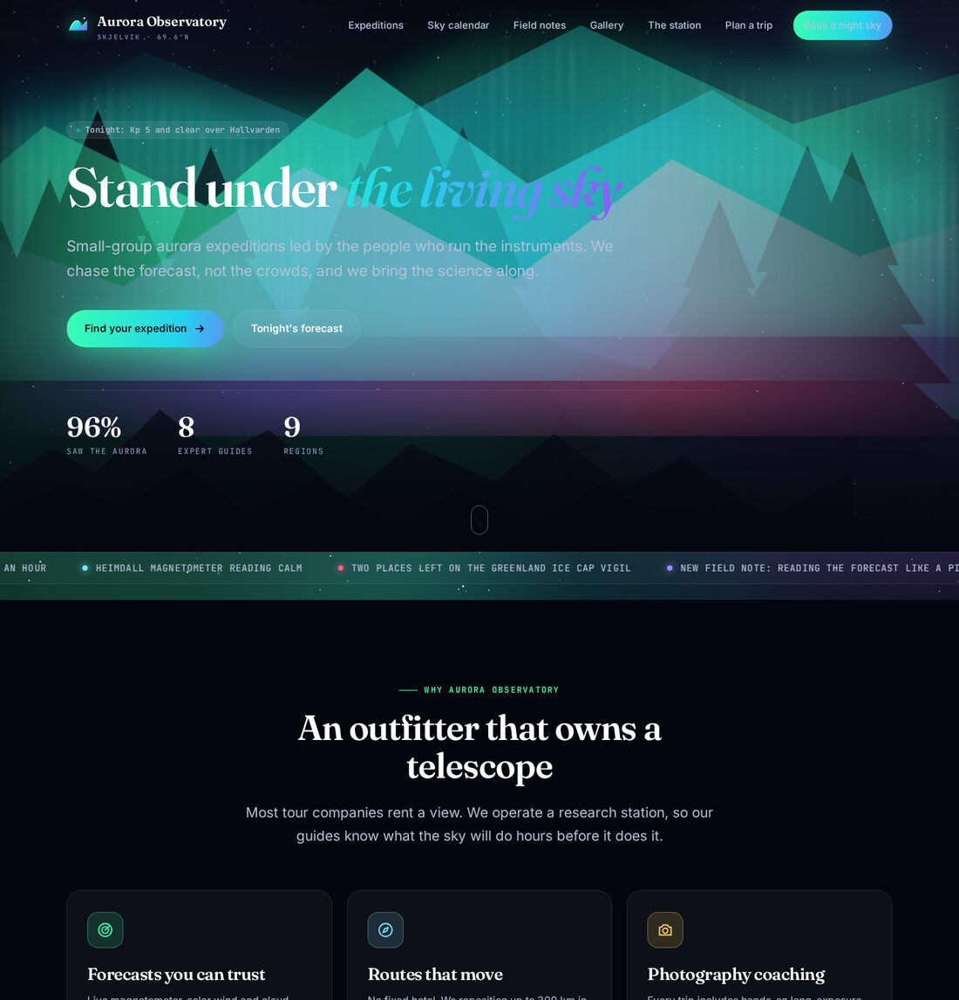
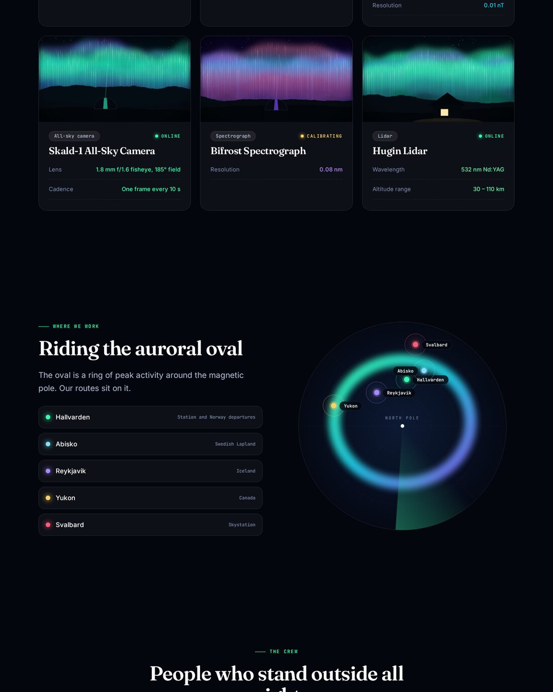

# Aurora Observatory

A complete, original Raytha site built end to end through the `raytha` CLI on an empty install: a dark-sky
expedition outfitter that also runs a geophysical station. Nothing was clicked in the admin UI.



| piece | what it uses |
|-------|--------------|
| **7 content types** (guides, expeditions, sky_events, posts, photographs, instruments, voices) | all 13 field types: single/long text, wysiwyg, number, date, checkbox, dropdown, radio, multiple select, attachment, relationship, colour, repeater |
| **70 items** | originals written for this site: people, routes, sky events, essays, photographs, instruments, reviews; 70 procedurally drawn SVG images uploaded to the media library |
| **Theme `aurora`** | a full design system (CSS and JS as theme media), one base layout, 7 list and 7 detail templates, 2 page templates, restyled 403/404/500 |
| **18 custom widgets** | hero, ticker, Kp forecast dial, features, expedition showcase (takes a view), stats, timeline, voices wall, photo mosaic, guide cards, split, calendar, CTA, FAQ, auroral-oval map, instruments, pricing, quote |
| **18 views** | a published list per type plus 11 curated filtered views (featured, gentle, polar crossings, storm watch, live streams, hero shots, ...) |
| **5 site pages** | home, the station, plan your trip, forecast and contact, each composed from the widgets |
| **2 menus** | main and footer |




## Build it

```bash
cargo build --release          # from the repo root
export RAYTHA_URL=http://localhost:5200 RAYTHA_API_KEY=...
examples/aurora-observatory/build.sh
```

Needs `python3`, `rsvg-convert` and ImageMagick (`magick`). Every script is idempotent, so re-running after an edit
only applies the difference.

1. `01_schema.py`: content types and fields (`schema.py` is the model).
2. `02_media.py`: draws the art (`art.py`) and uploads it.
3. `03_theme.py`: compiles the theme and runs `raytha theme push --activate`. The compile step is plain text
   substitution: `@@media:x.css@@` to an object key, `| @region` to a chain of `replace` filters built from the
   schema choices, `@@chips:field@@` to filter buttons, `@@pager@@` to pagination.
4. `04_seed.py`: creates items in dependency order and resolves relationships to ids.
5. `05_views.py`, `06_menus.py`, `07_pages.py`.
