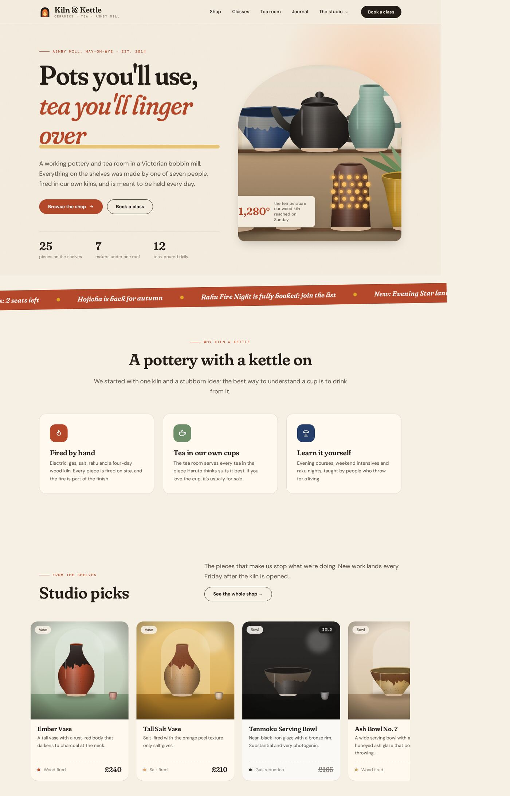
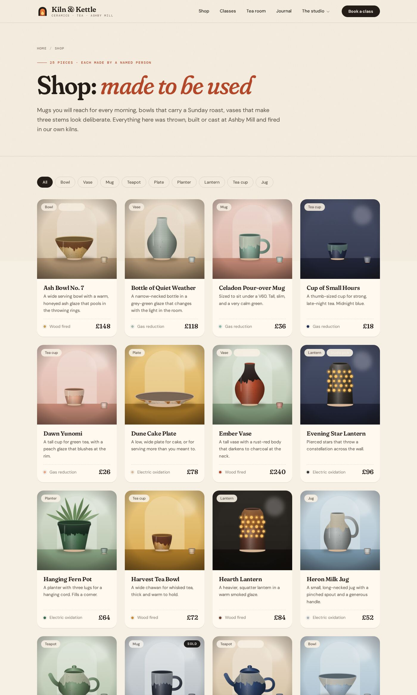
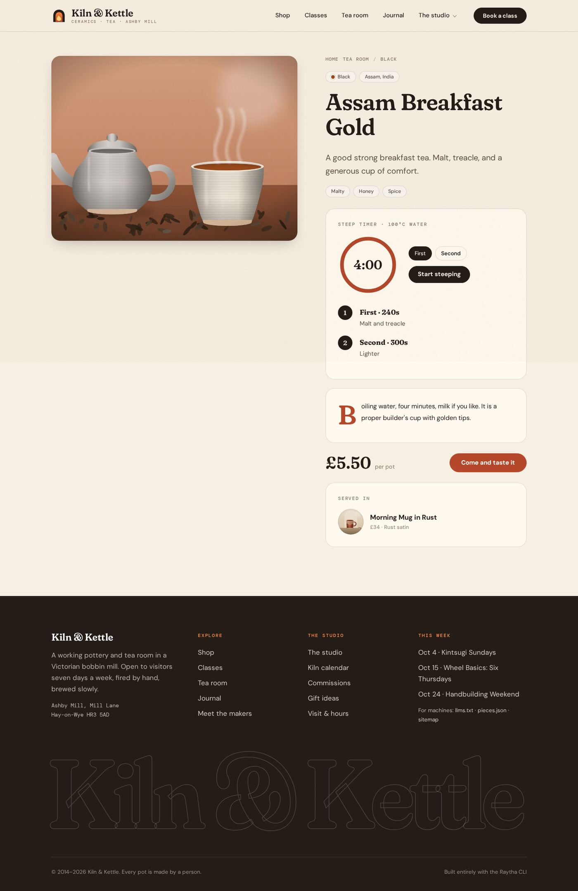
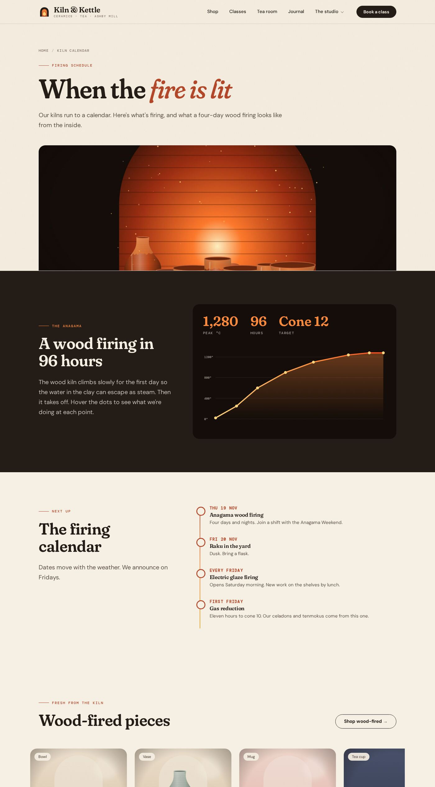

# Kiln & Kettle

A second end-to-end demo, built on a freshly wiped Raytha 2.0.0 through the `raytha` CLI and nothing else: a
working pottery and tea room in a Victorian bobbin mill. It sells hand-thrown pieces, runs wheel classes and serves
tea in its own cups.



| piece | what it uses |
|-------|--------------|
| **5 content types** (makers, pieces, workshops, teas, journal) | all 13 field types: single/long text, wysiwyg, number, date, checkbox, dropdown, radio, multiple select, attachment, relationship, colour, repeater |
| **63 items** | 7 makers, 25 pieces, 10 workshops, 12 teas, 9 journal entries; pieces point at their maker, teas at the piece they are served in; 76 procedurally drawn SVG images uploaded as attachments |
| **Theme `kiln`** | a design system in theme media (Fraunces and DM Sans, paper, ink, clay, indigo, celadon, mustard), one base layout, 5 list and 5 detail templates, a page template, restyled 403/404/500 |
| **19 custom widgets** | hero, marquee, features, showcase (takes a view and renders per-type cards), split, process, stats, quote, tea board, kiln temperature curve, timeline, gallery, hours with map, FAQ, CTA, page hero, rich text, pricing, enquiry form |
| **17 views** | a default list per type plus curated filtered ones (ready to ship, studio picks, wood-fired, under £50, mugs, open classes, beginners, weekends, seasonal teas, ...) |
| **6 site pages** | home, the studio, visit, kiln calendar, commissions, gift ideas, each composed from the widgets |
| **2 menus** | main (with a dropdown) and footer; both drive the theme through `get_main_menu()` and `get_menu("footer")` |
| **6 functions** | `/pieces.json`, `/llms.txt`, `/sitemap.xml` (HTTP), `/enquiry` (HTTP POST that sends mail), a Liquid helper (`raytha_function("kiln_helpers", "money", ...)`) and a `content_item_created` event |





## Build it

```bash
cargo build --release          # from the repo root
export RAYTHA_URL=http://localhost:5200 RAYTHA_API_KEY=...
examples/kiln-and-kettle/build.sh
```

Needs `python3`, `rsvg-convert` and ImageMagick (`magick`). Every script is idempotent. The last step is
`raytha check`, which requests all 88 public routes and fails if any is broken.

Raytha 2.0.0 rejects any base layout on save (`Unknown tag 'renderbody'`); apply `raytha-renderbody-fix.patch` to the
server first. See [RAYTHA_BUGS.md](../../RAYTHA_BUGS.md).

## Raytha bugs found while building it

Listed in [RAYTHA_BUGS.md](../../RAYTHA_BUGS.md).
